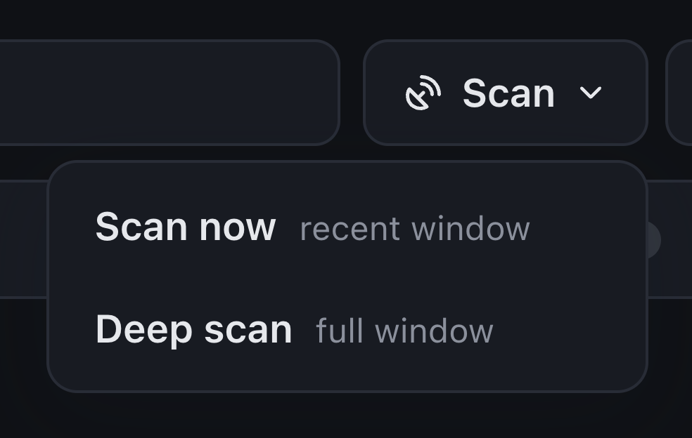
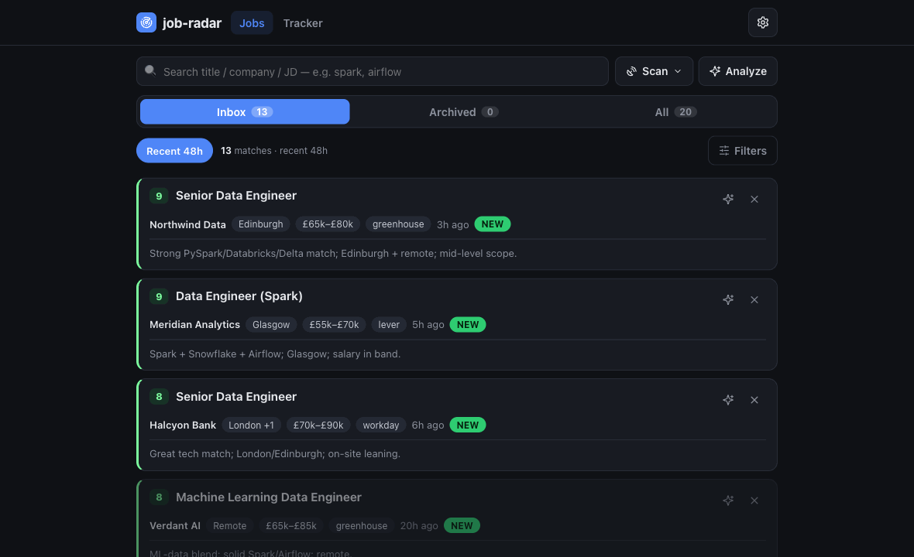
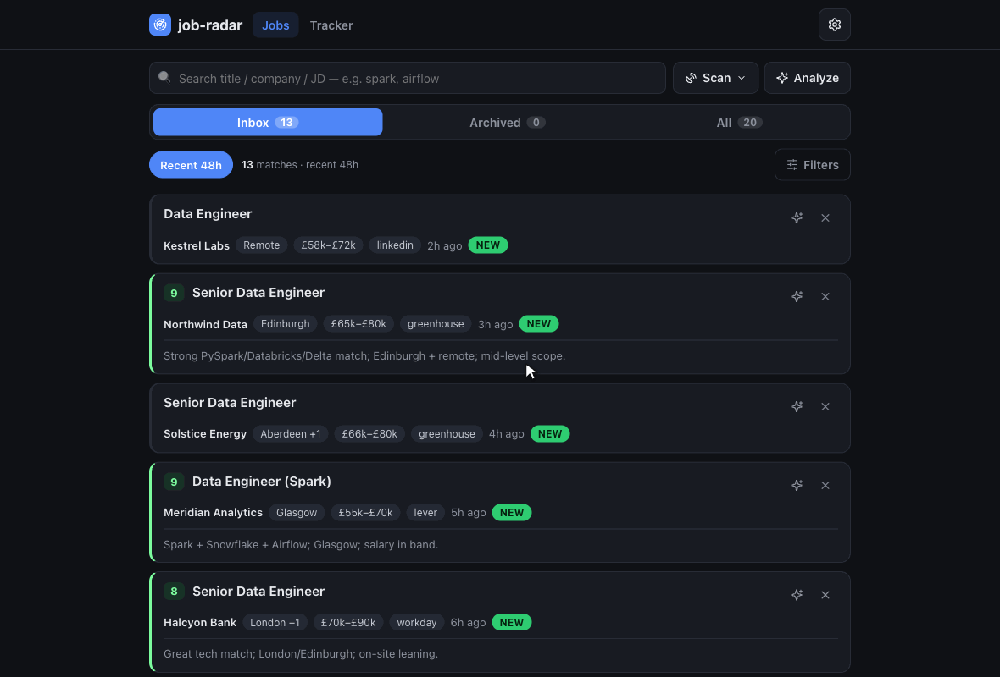
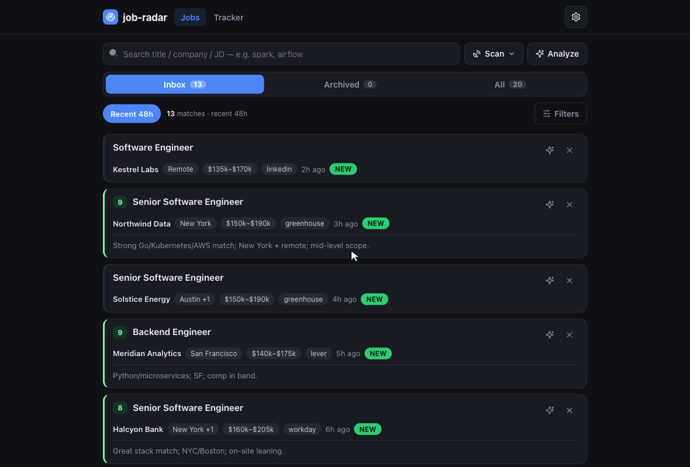
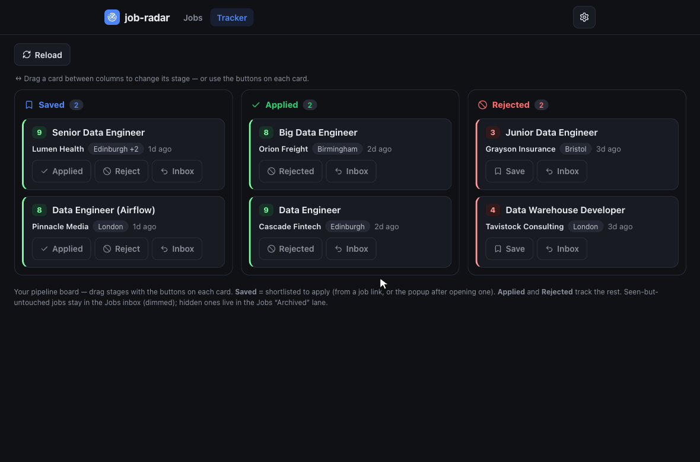
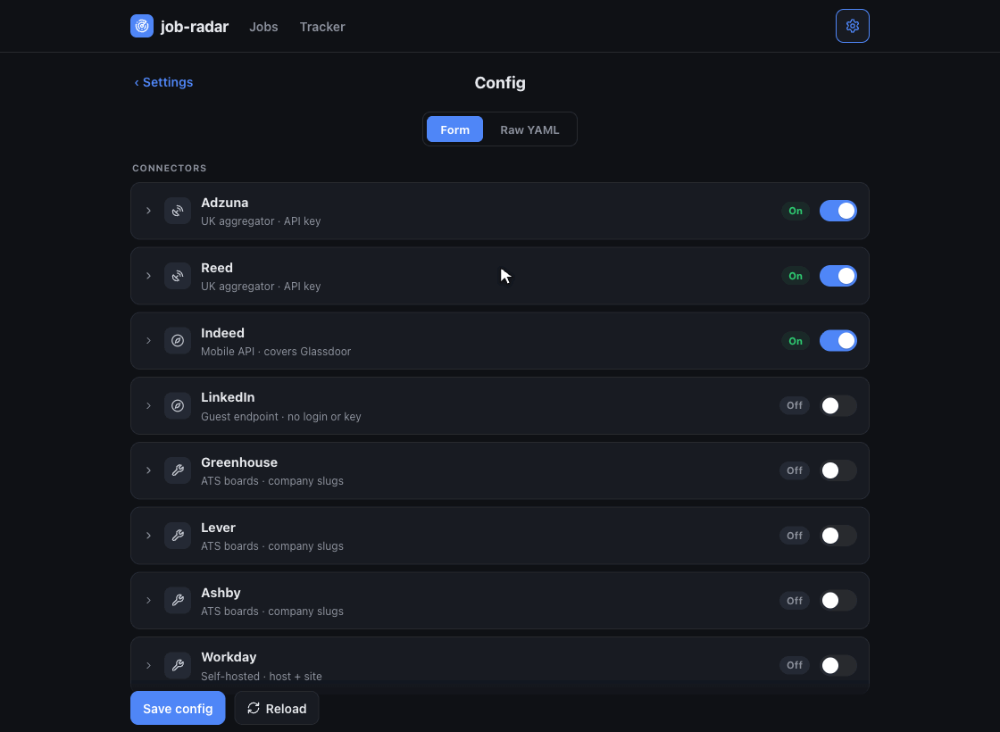
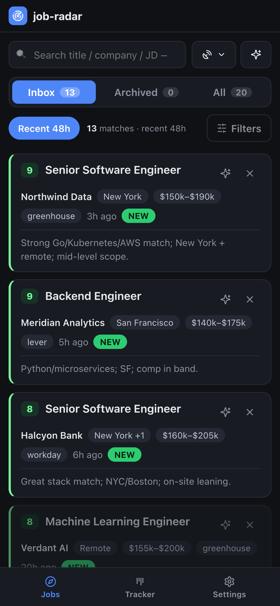
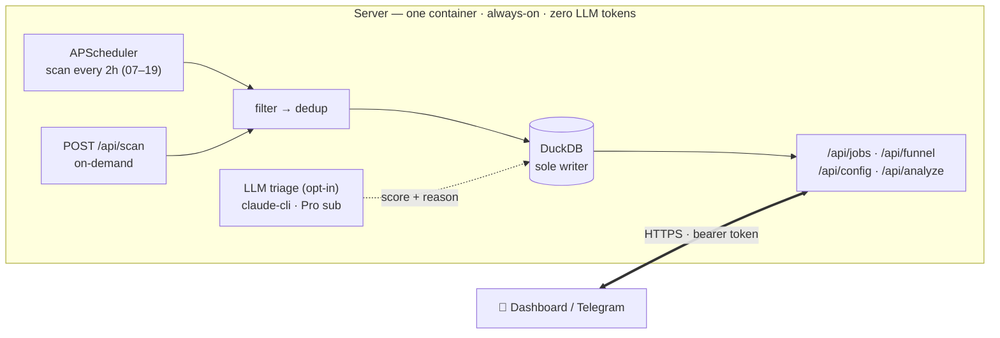

# job-hunt

Deterministic job-discovery pipeline — scans job sources on a schedule, filters and dedups without
touching an LLM, and serves the shortlist to a phone-friendly dashboard. Fully config-driven: point it at
any roles, tech stack, and locations you like.

## The idea

A job search split into two tiers by what each one *should* cost:

- **Discovery** (find jobs, filter, dedup) — pure HTTP + SQL. **Zero LLM tokens.** The core of this repo.
- **Triage** (a quick 0–10 fit score per role) — a cheap, bounded, *optional* on-server LLM pass so you
  can rank the shortlist from your phone. Runs on your Claude **Pro subscription** via Claude Code
  headless (no per-token cost), or the metered API. Clearly separated from discovery.

`job-hunt` scans your configured sources on a schedule, filters + dedups, and **triages the survivors** for fit —
**LLM cost only on jobs that survive filtering, never the raw firehose.** The locked principle holds:
**discovery is deterministic; triage is bounded and opt-in.**

## Features

*Screens below use **synthetic demo data** (`scripts/seed_demo.py`), configured for generic US
software-engineering roles — fake companies, not live listings.*

### Discovery — deterministic, zero LLM tokens

- **10 source connectors** — Adzuna + Reed + Indeed (aggregators; Indeed also covers Glassdoor), LinkedIn
  (public guest endpoint), Greenhouse / Lever / Ashby / Workable (company ATS boards), and Workday / Oracle
  ORC (self-hosted enterprise sites). Adding a source is one file + one registry line.
- **Per-location targeting** — each priority area (your target metros + a nationwide pass) gets its own
  date-sorted query budget, so one high-volume metro can't crowd the smaller ones out of the results.
- **Server-side narrowing** — Adzuna `category=it-jobs`, full-text `what_exclude`, and a tight
  `max_days_old` window keep the result budget focused (and under the API's daily call limit).
- **Title + location filters** — case-insensitive include/exclude lists, kept as broad or tight as you want.
- **Full-JD enrichment** — aggregator search APIs return a ~450-char snippet; for sources with a detail
  API (Reed) the full JD is fetched once after filter+merge (a `jd_full` flag → fetched exactly once) and
  stored back, so triage and search work on the real text, not a snippet.

**Two scan depths** — every scan honours a window. **Scan now** pulls only the recent window
(`recent_days`) — cheap, fresh-only, for the regular schedule. **🔭 Deep scan** pulls the full window —
for the first load or a weekly top-up.

<p align="center"></p>

### Find the stack — full-text JD search & dedup

Each inbox row is **one vacancy** — the **London +1** chip means the same posting was found in several
cities and collapsed. Search runs server-side over the **description**, so `kubernetes` finds roles even
when it isn't in the title (here the list narrows from 13 to 4).



- **Write-time dedup** — identity is `vacancy_key = sha1(company | title)`, source- and city-agnostic:
  tracking-token variants, agency reposts under new ad-ids, the *same ad on multiple sources*, and the
  *same posting listed in several cities* all collapse to one row. City becomes a chip + "+N", so no
  opening is lost.
- **Closed-job expiry + generations** — a job that drops off its source for `expire_after_hours` is marked
  `expired`; if it *reappears after expiring* it gets a fresh row (a new evaluation), the old one kept as
  history.

### Triage — optional on-server LLM, bounded & opt-in

Scores each pending job **0–10** against your rubric (`analysis/rubric.md`) with a one-line reason. Hit
**Analyze** and every pending job joins a queue; the fit badge fills in as the worker drains it.



Or pick jobs one at a time with the **✨** on a card — they line up in the same single-worker queue and
score one by one.



- **Pluggable engine** — `claude-cli` (Claude Code on your Pro subscription, no per-token cost — the
  default) or `api` (metered Anthropic SDK). Same rubric, forced-JSON output, usage ledger.
- **Guardrails** — manual-trigger only, `max_jobs` cap per run, single-flight lock, hidden jobs never
  scored, and a clean stop + alert when a usage/rate limit is hit. A usage view shows calls / tokens per run.

### Track your applications

Open a job and a return-popup asks *Applied / Viewed / Not-interested*. The **📌 Tracker** is a kanban
board — Saved → Applied → Rejected, one click per stage (or drag a card). Dismissed jobs hide; applied
jobs leave the inbox but are never lost.



### Config & rubric over the wire

Expand any connector, the LLM-triage engine, or the always-on title/location filters and edit them from
the browser (`/api/config`, `/api/rubric`) — validated server-side, applied on the next scan/run, no
redeploy.



### Phone & notifications

The whole dashboard is responsive, with a bottom nav bar. A **Telegram bot** pushes new-match alerts and
rich score cards (`/jobs [search]`, `/top`, `/analyze`, `/funnel`, `/scan`, with inline buttons).

<p align="center"></p>

### Sync & ops

- **HTTP API** — bearer-token. The dashboard and Telegram bot are its clients (`/api/jobs`, `/api/funnel`,
  `/api/scan`, `/api/analyze`, `/api/config`); the server's DuckDB is the single source of truth, one writer.
- **One Docker service** — deploy on any container host; secrets come from the environment.

## Deployment shape



One process owns the database — it serves the API/dashboard **and** runs both the scheduled and
on-demand scans, so there's a single DB writer and no lock fights. Discovery needs no login and no human,
so it runs unattended. Secrets come from the environment and `config.yml` is edited through `/api/config`
— neither lives in git.

## Quick start (local)

```bash
# install uv (manages its own Python 3.11+): https://docs.astral.sh/uv/
uv sync
cp config.example.yml config.yml      # edit: titles, location, sources
cp .env.example .env                  # add Adzuna + Reed API keys
uv run job-scan --dry-run             # preview, writes nothing
uv run job-scan                       # real scan into data/jobs.duckdb
uv run job-serve                      # serve API + dashboard, schedule + on-demand scans
```

## Deploy (server, Docker)

```bash
docker compose up -d --build          # single service; reads secrets from the environment
```

Runs anywhere Docker does — a VPS, a container host, a home server. Provide secrets as env vars
(`ADZUNA_*`, `REED_API_KEY`, `JOB_RADAR_API_TOKEN`, `SCAN_HOURS`, `TZ`, optional `TELEGRAM_*`);
`config.yml` / `rubric.md` are edited through the API and stored on the data volume, never in git.
To reach the dashboard from your phone, put the published port behind any reverse proxy or tunnel you
like. *(I run it as a Portainer GitOps stack behind a Cloudflare Tunnel — one example, not a requirement.)*

**Triage auth (optional):** the image also bundles Node + the Claude Code CLI. To run on-server triage
on your Pro subscription, mint a token once with `claude setup-token` and set `CLAUDE_CODE_OAUTH_TOKEN`
as a stack env var (or set `ANTHROPIC_API_KEY` and `analysis.engine: api` for the metered path). Leave
both unset to run discovery-only.

## Sources

| Provider | Covers |
|----------|--------|
| Adzuna | Broad aggregator (multi-country via `country`), nationwide |
| Reed | Direct UK job board, nationwide |
| Indeed | Indeed's mobile API — also covers Glassdoor (shared index); no login/key |
| LinkedIn | Public **guest** jobs endpoint (no login/cookie/key), only per-IP rate limiting; opt-in |
| Greenhouse / Lever / Ashby | Companies worldwide (board slugs; vanity-domain boards work too) |
| Workable | Companies hosting their board on Workable |
| Workday | Enterprises self-hosting Workday (`{host, site}` per tenant) |
| Oracle ORC | Enterprises on Oracle Cloud Recruiting (self-hosted CandidateExperience sites) |

Adding a source is one file + one registry line. The connectors target sources with a clean HTTP/JSON
surface; anything without one (bespoke portals, one-off boards) is out of scope by design.
