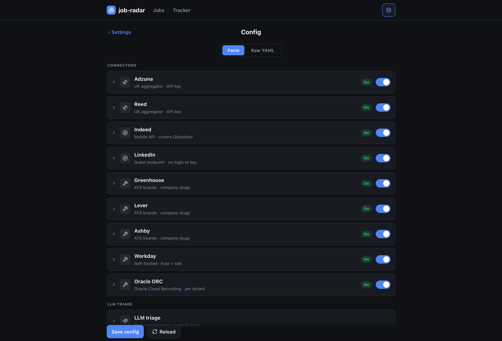
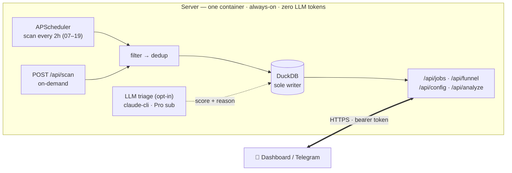

# job-hunt

Deterministic UK job-discovery pipeline for Data Engineering roles — scans job sources on a schedule,
filters and dedups without touching an LLM, and serves the shortlist to a phone-friendly dashboard.

## The idea

A job search split into two tiers by what each one *should* cost:

- **Discovery** (find jobs, filter, dedup) — pure HTTP + SQL. **Zero LLM tokens.** The core of this repo.
- **Triage** (a quick 0–10 fit score per role) — a cheap, bounded, *optional* on-server LLM pass so you
  can rank the shortlist from your phone. Runs on your Claude **Pro subscription** via Claude Code
  headless (no per-token cost), or the metered API. Clearly separated from discovery.

`job-hunt` scans UK sources on a schedule, filters + dedups, and **triages the survivors** for fit —
**LLM cost only on jobs that survive filtering, never the raw firehose.** The locked principle holds:
**discovery is deterministic; triage is bounded and opt-in.**

## Screenshots

The dashboard is phone-first and talks to the API over HTTP. Everything below runs on **synthetic demo
data** (`scripts/seed_demo.py` — fake companies, real tech stacks), not live listings.

### Find a job — full-text JD search

The inbox is deterministic discovery; each row is one vacancy (the **London +1** chip means the same
posting was found in several cities and collapsed). Type `databricks` and it matches roles whose
**description** mentions it even when the title doesn't — the list narrows from 13 to 4.


### Triage — pick jobs, they queue, scores land

The optional LLM pass scores each pending job 0–10 against your rubric. Hit **Analyze** (or the ✨ on a
single card); jobs go into a queue that drains with live progress, and the fit badge + one-line reason
fill in as each completes.


### Track a role through the pipeline

The **📌 Tracker** is a kanban board — Saved → Applied → Rejected, one click per stage (or drag a card).
Opening a job auto-marks it viewed.


### Two scan depths

Every scan honours a window. **Scan now** pulls only the recent window (`recent_days`) — cheap, fresh-only,
for the regular schedule. **Deep scan** pulls the full window — for the first load or a weekly top-up.


### Config over the wire

Toggle every connector and edit filters & the triage rubric from the browser — validated server-side,
applied on the next scan, no redeploy.



### Phone

The whole dashboard is responsive, with a bottom nav bar.

<p align="center"></p>

## Features

**Discovery (deterministic — zero LLM tokens)**
- **10 source connectors** — Adzuna + Reed + Indeed (aggregators; Indeed also covers Glassdoor), LinkedIn
  (public guest endpoint), Greenhouse / Lever / Ashby / Workable (company ATS boards), and Workday / Oracle
  ORC (self-hosted enterprise sites). Adding a source is one file + one registry line.
- **Per-location targeting** — each priority area (Edinburgh / Glasgow / London / nationwide) gets its own
  date-sorted query budget, so high-volume London can't crowd Scotland out of the results.
- **Server-side narrowing** — Adzuna `category=it-jobs`, full-text `what_exclude`, and a tight
  `max_days_old` window keep the result budget focused (and under the API's daily call limit).
- **Title + location filters** — case-insensitive include/exclude lists, kept broad (all UK + remote).
- **Deep vs regular scans** — a 🔭 deep scan pulls the full window (initial / weekly full load); regular
  scheduled scans use a tighter `recent_days` window — cheaper, fresh-only.
- **Full-JD enrichment** — aggregator search APIs return a ~450-char snippet; for sources with a detail
  API (Reed) the full JD is fetched once after filter+merge (a `jd_full` flag → fetched exactly once) and
  stored back, so triage and search work on the real text, not a snippet.

**Dedup & lifecycle**
- **Write-time dedup** — identity is `vacancy_key = sha1(company | title)`, source- and city-agnostic:
  tracking-token variants, agency reposts under new ad-ids, the *same ad on multiple sources*, and the
  *same posting listed in several cities* all collapse to one row. City is an attribute — a multi-city
  posting accumulates a `locations` set (shown as a chip + "+N"), so no opening is lost.
- **Closed-job expiry + generations** — a job that drops off its source for `expire_after_hours` is marked
  `expired`; the same window is the dedup horizon, so a posting that *reappears after expiring* gets a
  fresh row (a new evaluation), while the old one is kept as history.
- **Single DB writer** — one process owns DuckDB (scheduled + on-demand scans + API), no lock fights.

**Triage (optional on-server LLM — bounded, opt-in)**
- **0–10 fit scoring** — scores each pending job against a personal rubric (`analysis/rubric.md`, gitignored)
  from the stored JD, with a one-line reason. Triggered from the dashboard/phone, never automatically.
- **Pluggable engine** — `claude-cli` (Claude Code on your Pro subscription, no per-token cost — the default)
  or `api` (metered Anthropic SDK). Same rubric, forced-JSON output, usage ledger.
- **Guardrails** — manual-trigger only, `max_jobs` cap per run, single-flight lock, hidden jobs never scored,
  and a clean stop + alert when a usage/rate limit is hit. A usage view shows calls / tokens per run.

**Dashboard & notifications**
- **Phone-friendly web dashboard** (`GET /`) — funnel chips, score-ranked job list (colour-coded badges),
  filters (status / location / source / min-salary), and server-side full-text **JD search** (find *spark*,
  *airflow* even when not in the title).
- **Application tracking** — open a job, and on return a popup asks *Applied / Viewed / Not interested*; a
  **📌 Tracker** tab holds your pipeline (Applied / Rejected) with stage moves. Dismissed jobs hide; applied
  jobs leave the inbox but are never lost.
- **Editors over the wire** — edit `config.yml` and the triage `rubric.md` from your phone (`/api/config`,
  `/api/rubric`); validated, applied on the next scan/run, no redeploy.
- **Telegram bot** — push notifications on new matches, plus rich score cards: `/jobs [search]`, `/top`,
  `/analyze` (run triage), `/funnel`, `/scan`, with inline buttons.

**Sync & ops**
- **HTTP API** — bearer-token. The dashboard and Telegram bot are its clients (`/api/jobs`, `/api/funnel`,
  `/api/scan`, `/api/analyze`, `/api/config`); the server's DuckDB is the single source of truth.
- **Config over the wire** — `GET/POST /api/config`, stored on the data volume, never in git.
- **One Docker service** — deploy on any container host; secrets come from the environment.

## Deployment shape



One process owns the database — it serves the API/dashboard **and** runs both the scheduled and
on-demand scans, so there's a single DB writer and no lock fights. Discovery needs no login and no human,
so it runs unattended. Secrets come from the environment and `config.yml` is edited through `/api/config`
— neither lives in git.

## Quick start (local)

```bash
# install uv (manages its own Python 3.11+): https://docs.astral.sh/uv/
uv sync
cp config.example.yml config.yml      # edit: titles, location, sources
cp .env.example .env                  # add Adzuna + Reed API keys
uv run job-scan --dry-run             # preview, writes nothing
uv run job-scan                       # real scan into data/jobs.duckdb
uv run job-serve                      # serve API + dashboard, schedule + on-demand scans
```

## Deploy (server, Docker)

```bash
docker compose up -d --build          # single service; reads secrets from the environment
```

Runs anywhere Docker does — a VPS, a container host, a home server. Provide secrets as env vars
(`ADZUNA_*`, `REED_API_KEY`, `JOB_RADAR_API_TOKEN`, `SCAN_HOURS`, `TZ`, optional `TELEGRAM_*`);
`config.yml` / `rubric.md` are edited through the API and stored on the data volume, never in git.
To reach the dashboard from your phone, put the published port behind any reverse proxy or tunnel you
like. *(I run it as a Portainer GitOps stack behind a Cloudflare Tunnel — one example, not a requirement.)*

**Triage auth (optional):** the image also bundles Node + the Claude Code CLI. To run on-server triage
on your Pro subscription, mint a token once with `claude setup-token` and set `CLAUDE_CODE_OAUTH_TOKEN`
as a stack env var (or set `ANTHROPIC_API_KEY` and `analysis.engine: api` for the metered path). Leave
both unset to run discovery-only.

## Sources

| Provider | Covers |
|----------|--------|
| Adzuna (`gb`) | Broad UK aggregator (Reed/Totaljobs/CV-Library/company sites), nationwide |
| Reed | Direct UK, nationwide |
| Indeed | Indeed's mobile API — also covers Glassdoor (shared index); no login/key |
| LinkedIn | Public **guest** jobs endpoint (no login/cookie/key), only per-IP rate limiting; opt-in |
| Greenhouse / Lever / Ashby | UK + global companies (board slugs; vanity-domain boards work too) |
| Workable | Companies hosting their board on Workable |
| Workday | Enterprises self-hosting Workday (`{host, site}` per tenant) |
| Oracle ORC | Enterprises on Oracle Cloud Recruiting (self-hosted CandidateExperience sites) |

Adding a source is one file + one registry line. The connectors target sources with a clean HTTP/JSON
surface; anything without one (bespoke portals, one-off boards) is out of scope by design.
