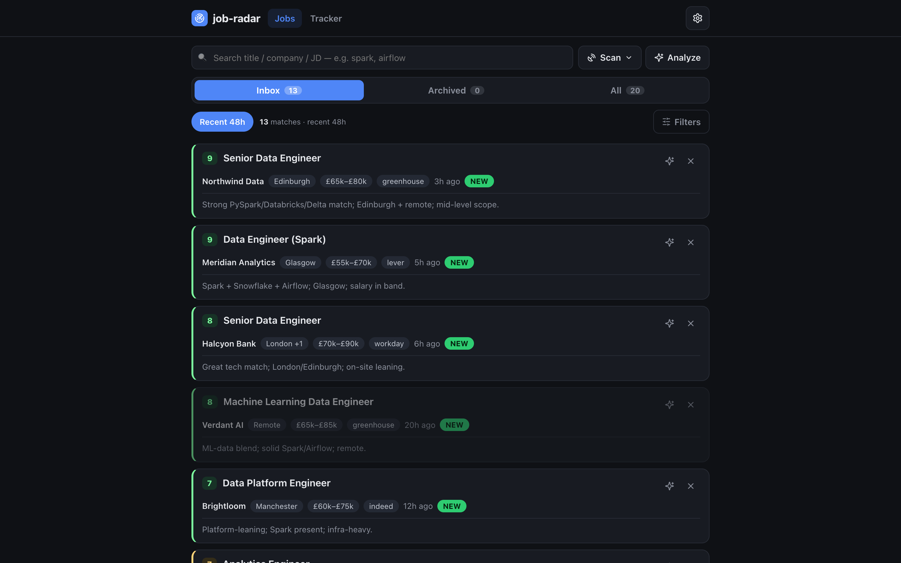
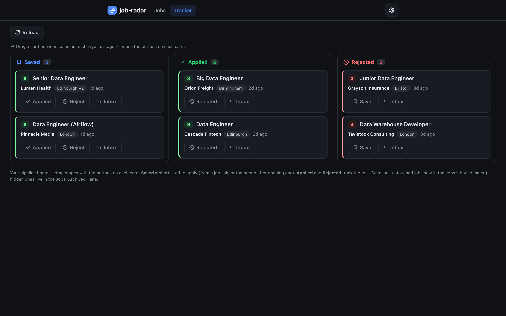
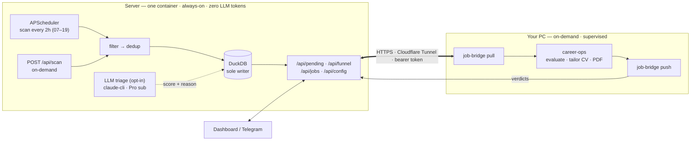

# job-hunt

Deterministic UK job-discovery pipeline. Inspired by [santifer/career-ops](https://github.com/santifer/career-ops),
but it owns the half career-ops is weak at: **discovery**.

## The idea

A job search split into tiers by what each one *should* cost:

- **Discovery** (find jobs, filter, dedup) — pure HTTP + SQL. **Zero LLM tokens.** The core of this repo.
- **Triage** (a quick 0–10 fit score per role) — a cheap, bounded, *optional* on-server LLM pass so you
  can rank the shortlist from your phone. Runs on your Claude **Pro subscription** via Claude Code
  headless (no per-token cost), or the metered API. Clearly separated from discovery.
- **Deep evaluation** (full report, tailor CV, draft answers) — heavier LLM work, delegated to
  [career-ops](https://github.com/santifer/career-ops) on your PC under human review.

`job-hunt` scans UK sources on a schedule, filters + dedups, **triages the survivors** for fit, and feeds
the best into career-ops — **LLM cost only on jobs that survive filtering, never the raw firehose.** The
locked principle holds: **discovery is deterministic; triage is bounded and opt-in; deep eval is supervised.**

## Screenshots

The dashboard is phone-first and talks to the API over a Cloudflare Tunnel. Everything below runs on
**synthetic demo data** (`scripts/seed_demo.py` — fake companies, real tech stacks), not live listings.



*The Jobs inbox. Deterministic discovery fills the list; the optional LLM triage adds the 0–9 fit badge
and one-line reason on the left. One row per vacancy — the **London +1** chip means the same posting was
found in several cities and collapsed to a single row.*

### Search the JD, not just the title · Track a role through the pipeline

| Full-text JD search | Kanban tracker |
|---|---|
|  |  |
| Type `spark` — it matches roles whose **description** mentions it even when the title doesn't (13 → 9). | Saved → Applied → Rejected, one click per stage. Opening a job auto-marks it viewed. |

### More views

| Tracker board | Config over the wire | Phone |
|:---:|:---:|:---:|
|  |  |  |
| Saved / Applied / Rejected columns | Toggle every connector, edit filters & rubric — no redeploy | Responsive, with a bottom nav bar |

## Features

**Discovery (deterministic — zero LLM tokens)**
- **10 source connectors** — Adzuna + Reed + Indeed (aggregators; Indeed also covers Glassdoor), LinkedIn
  (public guest endpoint), Greenhouse / Lever / Ashby / Workable (company ATS boards), and Workday / Oracle
  ORC (self-hosted enterprise sites). Adding a source is one file + one registry line.
- **Per-location targeting** — each priority area (Edinburgh / Glasgow / London / nationwide) gets its own
  date-sorted query budget, so high-volume London can't crowd Scotland out of the results.
- **Server-side narrowing** — Adzuna `category=it-jobs`, full-text `what_exclude`, and a tight
  `max_days_old` window keep the result budget focused (and under the API's daily call limit).
- **Title + location filters** — case-insensitive include/exclude lists, kept broad (all UK + remote).
- **Deep vs regular scans** — a 🔭 deep scan pulls the full window (initial / weekly full load); regular
  scheduled scans use a tighter `recent_days` window — cheaper, fresh-only.
- **Full-JD enrichment** — aggregator search APIs return a ~450-char snippet; for sources with a detail
  API (Reed) the full JD is fetched once after filter+merge (a `jd_full` flag → fetched exactly once) and
  stored back, so triage and search work on the real text, not a snippet.

**Dedup & lifecycle**
- **Write-time dedup** — identity is `vacancy_key = sha1(company | title)`, source- and city-agnostic:
  tracking-token variants, agency reposts under new ad-ids, the *same ad on multiple sources*, and the
  *same posting listed in several cities* all collapse to one row. City is an attribute — a multi-city
  posting accumulates a `locations` set (shown as a chip + "+N"), so no opening is lost.
- **Closed-job expiry + generations** — a job that drops off its source for `expire_after_hours` is marked
  `expired`; the same window is the dedup horizon, so a posting that *reappears after expiring* gets a
  fresh row (a new evaluation), while the old one is kept as history.
- **Single DB writer** — one process owns DuckDB (scheduled + on-demand scans + API), no lock fights.

**Triage (optional on-server LLM — bounded, opt-in)**
- **0–10 fit scoring** — scores each pending job against a personal rubric (`analysis/rubric.md`, gitignored)
  from the stored JD, with a one-line reason. Triggered from the dashboard/phone, never automatically.
- **Pluggable engine** — `claude-cli` (Claude Code on your Pro subscription, no per-token cost — the default)
  or `api` (metered Anthropic SDK). Same rubric, forced-JSON output, usage ledger.
- **Guardrails** — manual-trigger only, `max_jobs` cap per run, single-flight lock, hidden jobs never scored,
  and a clean stop + alert when a usage/rate limit is hit. A usage view shows calls / tokens per run.

**Dashboard & notifications**
- **Phone-friendly web dashboard** (`GET /`) — funnel chips, score-ranked job list (colour-coded badges),
  filters (status / location / source / min-salary), and server-side full-text **JD search** (find *spark*,
  *airflow* even when not in the title).
- **Application tracking** — open a job, and on return a popup asks *Applied / Viewed / Not interested*; a
  **📌 Tracker** tab holds your pipeline (Applied / Rejected) with stage moves. Dismissed jobs hide; applied
  jobs leave the inbox but are never lost.
- **Editors over the wire** — edit `config.yml` and the triage `rubric.md` from your phone (`/api/config`,
  `/api/rubric`); validated, applied on the next scan/run, no redeploy.
- **Telegram bot** — push notifications on new matches, plus rich score cards: `/jobs [search]`, `/top`,
  `/analyze` (run triage), `/funnel`, `/scan`, with inline buttons.

**Sync & ops**
- **HTTP API** to career-ops — `GET /api/pending` (shortlist out) / `POST /api/results` (verdicts back),
  bearer-token, over a Cloudflare Tunnel. The PC `job-bridge` pulls/pushes; the server's DuckDB stays the
  single source of truth.
- **Config over the wire** — `GET/POST /api/config`, stored on the data volume, never in git.
- **Deployed via Portainer GitOps** from this public repo; secrets are stack env vars.

## Deployment shape



One process owns the database — it serves the API/dashboard **and** runs both the scheduled and
on-demand scans, so there's a single DB writer and no lock fights. The PC only reads the shortlist
and posts back verdicts; the server's DuckDB is the single source of truth. No shared git repo.

Evaluation needs a logged-in Claude and human review, so it stays on your PC. Discovery needs neither,
so it runs unattended on the server. Deployed via **Portainer GitOps** from this public repo; secrets are
Portainer stack env vars and `config.yml` is edited through `/api/config` — neither lives in git.

## Quick start (local)

```bash
# install uv (manages its own Python 3.11+): https://docs.astral.sh/uv/
uv sync
cp config.example.yml config.yml      # edit: titles, location, sources
cp .env.example .env                  # add Adzuna + Reed API keys
uv run job-scan --dry-run             # preview, writes nothing
uv run job-scan                       # real scan into data/jobs.duckdb
uv run job-serve                      # serve API + dashboard, schedule + on-demand scans
```

## Deploy (server, Docker)

```bash
docker compose up -d --build          # single service; reads secrets from the environment
```

On the server this is a **Portainer GitOps** stack pointed at this repo: secrets are Portainer stack
env vars (`ADZUNA_*`, `REED_API_KEY`, `JOB_RADAR_API_TOKEN`, `SCAN_HOURS`, `TZ`, optional
`TELEGRAM_*`) and `config.yml` / `rubric.md` are edited through the API (stored on the data volume,
never in git). Point your own cloudflared tunnel at the published port.

**Triage auth (optional):** the image also bundles Node + the Claude Code CLI. To run on-server triage
on your Pro subscription, mint a token once with `claude setup-token` and set `CLAUDE_CODE_OAUTH_TOKEN`
as a stack env var (or set `ANTHROPIC_API_KEY` and `analysis.engine: api` for the metered path). Leave
both unset to run discovery-only.

## Sources

| Provider | Covers |
|----------|--------|
| Adzuna (`gb`) | Broad UK aggregator (Reed/Totaljobs/CV-Library/company sites), nationwide |
| Reed | Direct UK, nationwide |
| Indeed | Indeed's mobile API — also covers Glassdoor (shared index); no login/key |
| LinkedIn | Public **guest** jobs endpoint (no login/cookie); deep-scan cadence, opt-in |
| Greenhouse / Lever / Ashby | UK + global companies (board slugs; vanity-domain boards work too) |
| Workable | Companies on Workable (e.g. Starling, Hugging Face) |
| Workday | Self-hosted enterprise sites (`{host, site}` per tenant — e.g. Live Nation, CrowdStrike) |
| Oracle ORC | Self-hosted CandidateExperience sites (e.g. JPMorgan, Goldman Sachs, Bank of England) |

Adding a source is one file + one registry line. Anything without a structured API (bespoke portals,
one-off boards) → paste the URL into career-ops's `pipeline.md` manually. That's the designed fallback,
not a gap.
